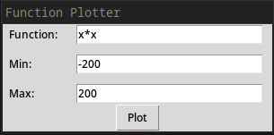
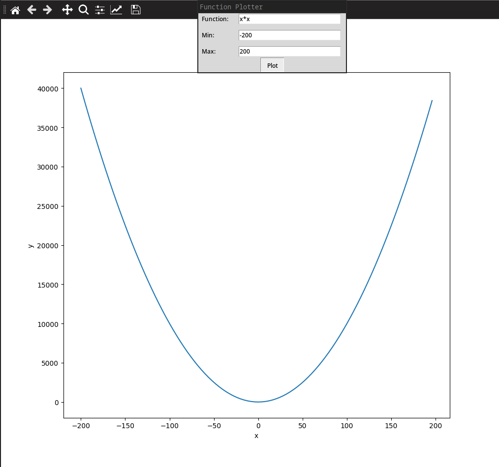
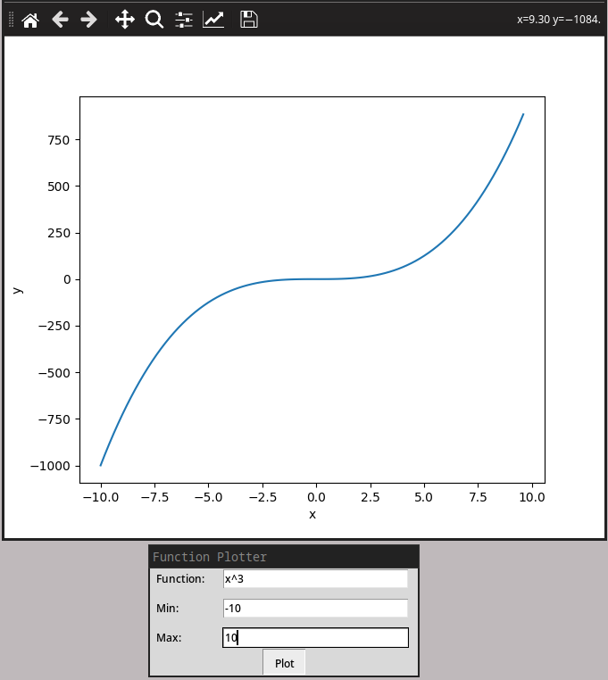
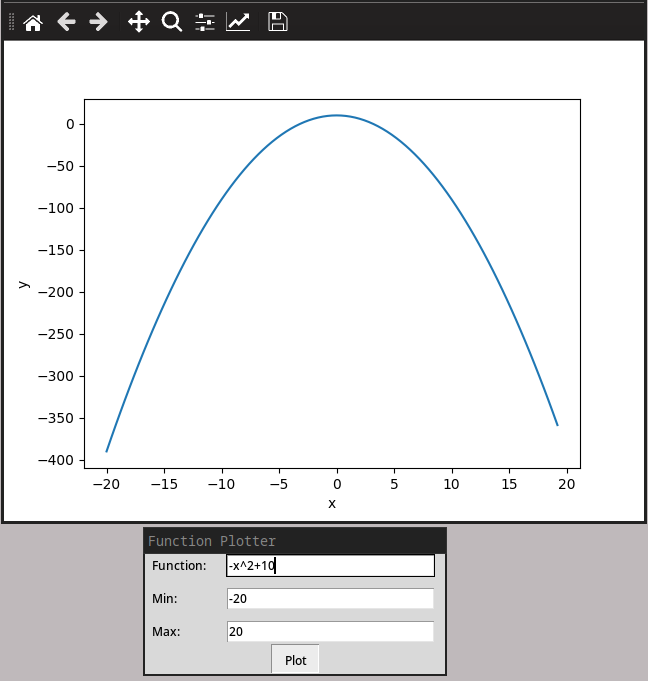
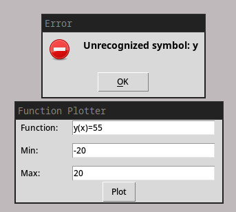
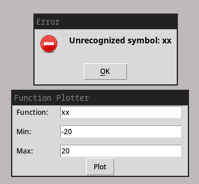
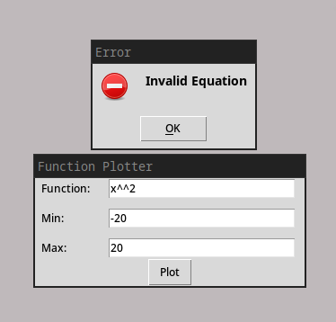

# Python Function Plotter

## Screenshots








### Dependiencies
```
tkinter         # standard python library
numpy
matplotlib
pytest          # needed for the tests
```

### How to run
to install the dependiencies
```
pip install -r requirements.txt
```
to run the program
```
python3 main.py
```

### How to test
```
pytest test_expression.py
```
